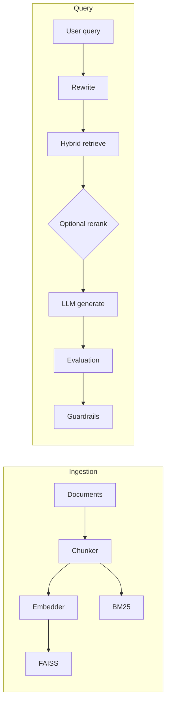

# RAG with Evaluation and Guardrails

Production-oriented Retrieval-Augmented Generation service: document ingestion, hybrid retrieval (BM25 + dense FAISS), optional LLM reranking, LLM-as-judge evaluation, embedding metrics, and guardrails (confidence, hallucination heuristics, fallbacks).

Runs against **OpenAI**, **Anthropic (Claude)**, or a fully local **open-source stack** (Ollama + sentence-transformers) — no API keys required.

## Architecture



### Design decisions

| Area | Choice | Tradeoff |
|------|--------|----------|
| Vector store | FAISS `IndexFlatIP` + L2-normalized vectors | Fast, local, no server ops; not sharded—scale horizontally by shard key per tenant |
| Hybrid | α·dense + (1−α)·sparse after min–max | Simple fusion; tune α per domain; no learned cross-encoder by default |
| Caching | Redis for embeddings + in-memory fallback | Cuts cost; requires Redis for multi-instance consistency |
| Judge | Separate LLM judge (OpenAI / Anthropic / Ollama) | Extra cost/latency; swap for smaller model or disable for dev |
| Providers | Pluggable: OpenAI, Anthropic, or fully-local (Ollama + sentence-transformers) | Local stack is free and private but slower and weaker than hosted frontier models |
| Guardrails | Embedding sim + judge + optional LLM self-check | Self-check adds latency; gated on bad signals |

### Module layout

- `core/` — settings, Pydantic models, protocols, logging, tracing, token ledger, cache
- `ingestion/` — chunkers (recursive, semantic), OpenAI embedder, FAISS + BM25 stores, pipeline
- `retrieval/` — hybrid fusion, query rewrite, optional reranker, query orchestration
- `llm/` — OpenAI and Anthropic chat clients (factory)
- `evaluation/` — LLM judge, embedding similarity metrics, `EvaluationMetrics`
- `guardrails/` — confidence, hallucination signals, insufficient-info / clarify fallbacks
- `api/` — FastAPI app and DI container

## Setup

```bash
cd rag_evals_guardrails
python -m venv .venv
source .venv/bin/activate
pip install -e ".[dev]"
cp .env.example .env
# Edit `.env` and set OPENAI_API_KEY (required for embeddings, default chat, and judge).
```

Settings load from **`.env` at the project root** (and optional `.env.local`), so the key works even if you start uvicorn from another directory.

Optional: Redis for embedding cache — set `REDIS_URL`.

**Security:** If an API key was ever committed or shared, rotate it in the OpenAI dashboard and replace it only in your local `.env` (never commit `.env`).

**Troubleshooting:** If `/ingest` or `/query` returns **503** with `insufficient_quota` / quota messaging, your OpenAI project needs **billing and credits** ([platform.openai.com/account/billing](https://platform.openai.com/account/billing)). The API now returns JSON with `hint` and `message` instead of a bare 500.

To skip Redis connection warnings, leave `REDIS_URL` empty in `.env` or remove that line.

## Run

```bash
export PYTHONPATH=.
uvicorn api.main:app --reload --host 0.0.0.0 --port 8000
```

**Interactive docs (Swagger UI):** [http://127.0.0.1:8000/docs](http://127.0.0.1:8000/docs) — try requests with **Authorize** if you add API keys later; examples are prefilled from the schemas.

**Alternatives:** ReDoc at `/redoc`, raw OpenAPI at `/openapi.json` — root `/` links to `/docs`.

## API

### `POST /ingest`

Body: `{ "documents": [ { "id": "...", "text": "...", "metadata": {} } ] }`

### `POST /query`

Body: `{ "query": "...", "top_k": 8, "skip_evaluation": false }`

Response includes `answer`, `retrieved_docs`, `confidence_score`, `evaluation_metrics`, `guardrail_action`, `trace`, `token_usage`.

## Configuration

Environment variables (see `core/config.py`): `LLM_PROVIDER`, `EMBEDDER_PROVIDER`, `CHAT_MODEL`, `JUDGE_MODEL`, `EMBEDDING_MODEL`, `OLLAMA_BASE_URL`, `CHUNKING_STRATEGY` (`recursive` | `semantic`), `HYBRID_ALPHA`, `USE_RERANKER`, `RAG_DEBUG`, `REDIS_URL`, paths for FAISS and BM25 persistence.

### Provider matrix

| Component | OpenAI | Anthropic | Open-source local |
|---|---|---|---|
| Embeddings | `text-embedding-3-small` | `text-embedding-3-small` (still OpenAI) | `sentence-transformers` (e.g. `BAAI/bge-small-en-v1.5`) |
| Chat / judge / rerank | `gpt-4o-mini` | `claude-3-5-haiku-*` | Ollama (e.g. `llama3.2:3b`) |
| Keys required | `OPENAI_API_KEY` | `ANTHROPIC_API_KEY` + `OPENAI_API_KEY` | none |

### Anthropic for chat (OpenAI still for embeddings)

- `LLM_PROVIDER=anthropic`
- `ANTHROPIC_API_KEY=...`
- `CHAT_MODEL` and `JUDGE_MODEL` to a **Claude** model id (e.g. `claude-3-5-haiku-20241022`). OpenAI-style ids (`gpt-...`) are rejected when `LLM_PROVIDER=anthropic`.

### Fully local, open-source (no API keys)

Run the whole pipeline without any hosted API:

1. Install Ollama and pull a small chat model:
   ```bash
   brew install ollama
   ollama serve &              # daemon on :11434
   ollama pull llama3.2:3b
   ```
2. Install the local embedder (already in `requirements.txt` / `pyproject.toml`):
   ```bash
   pip install sentence-transformers
   ```
3. Set in `.env`:
   ```dotenv
   LLM_PROVIDER=ollama
   EMBEDDER_PROVIDER=local
   EMBEDDING_MODEL=BAAI/bge-small-en-v1.5
   CHAT_MODEL=llama3.2:3b
   JUDGE_MODEL=llama3.2:3b
   OLLAMA_BASE_URL=http://localhost:11434/v1
   ```

Tradeoffs: first embed-model load is ~3s (weights cached under `~/.cache/huggingface`); first query loads llama3.2 into memory (~10–30s); subsequent queries run in 5–15s on an M-series Mac. Judge quality is weaker than `gpt-4o-mini` — consider lowering `MIN_CONFIDENCE_THRESHOLD` if guardrails become too strict.

## Sample data and example queries

Load `data/sample_documents.json` via `/ingest`, then:

1. **Query:** “What encryption is required for customer data?”  
   **Expected:** Answer grounded in the policy doc; retrieval should surface `policy-2024`.

2. **Query:** “How does hybrid retrieval balance sparse and dense?”  
   **Expected:** Answer references architecture note; `evaluation_metrics` should show reasonable faithfulness/relevance.

3. **Query:** “What is the exact CPU model in the datacenter?” (not in corpus)  
   **Expected:** Low confidence and/or guardrail `insufficient_info` or clarify, depending on thresholds.

## Tests

```bash
pytest tests/ -v
```

Tests use mocks for HTTP and LLM; a fake `OPENAI_API_KEY` is set in `conftest.py` for imports that require it.

## Observability

- Structured logging via `structlog` (JSON in non-debug mode).
- `trace` on query responses: steps, retrieval IDs; with `RAG_DEBUG=true`, prompt previews are included.

## Limitations / next steps

- FAISS upsert is append-only; duplicate `chunk_id` updates metadata only (vectors are not recomputed for the same id).
- BM25 index grows append-only; production would need delete-by-doc and reindex jobs.
- Reranker uses LLM scoring (costly); replace with cross-encoder for batch scoring.
