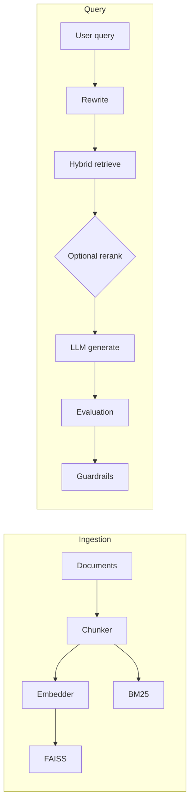

# RAG with Evaluation and Guardrails

A production-oriented Retrieval-Augmented Generation service with **labeled evaluation**, **guardrails**, and **pluggable providers** — runs against OpenAI, Anthropic (Claude), or a **fully local open-source stack** (Ollama + sentence-transformers) with no API keys.

[](https://github.com/khandelwaltushar/rag_evals_guardrails/actions/workflows/ci.yml)

## Results on the golden Q&A set

22-item labeled eval set (20 in-scope + 2 out-of-scope) over a 15-document corpus, scored by a separate LLM judge. Re-run locally with `python -m evaluation.runner`.

| Metric | Value (local stack) |
|---|---|
| Retrieval recall@5 | **100%** (20/20) |
| Out-of-scope refusal rate | **100%** (2/2) |
| Avg faithfulness (judge) | 0.73 |
| Avg relevance (judge) | 0.73 |
| Avg confidence | 0.72 |
| Latency p50 / p95 | 12.5s / 24.9s |
| Avg prompt / completion tokens | 1084 / 98 |

Provider: `ollama / llama3.2:3b` for chat + judge, `sentence-transformers / BAAI/bge-small-en-v1.5` (384 dim) for embeddings. Latency is dominated by the 3B local model; a hosted provider (`gpt-4o-mini` or `claude-3-5-haiku`) brings p50 well under 3s.

## Demo

Start it:

```bash
pip install -e ".[local,dev]"        # or ".[dev]" for OpenAI/Anthropic only
ollama serve & ollama pull llama3.2:3b  # skip if using OpenAI/Anthropic
cp .env.example .env                  # pick a provider (see "Provider matrix")
export PYTHONPATH=. && uvicorn api.main:app --port 8000
```

Try it:

```bash
# Ingest
curl -s -X POST localhost:8000/ingest -H 'content-type: application/json' \
  -d @data/sample_documents.json

# Query
curl -s -X POST localhost:8000/query -H 'content-type: application/json' \
  -d '{"query":"What encryption is required for customer data?"}' | jq

# Streaming (SSE) — tokens arrive live
curl -sN -X POST localhost:8000/query_stream -H 'content-type: application/json' \
  -d '{"query":"How does hybrid retrieval balance sparse and dense?"}'
```

Interactive docs (Swagger UI): [http://localhost:8000/docs](http://localhost:8000/docs) · ReDoc: `/redoc` · OpenAPI: `/openapi.json`

## What's interesting about this service

- **Real evaluation**, not vibes. 22-item golden set, labeled gold doc-ids, an LLM-as-judge, and an `evaluation.runner` script that reports retrieval recall@k, faithfulness, relevance, out-of-scope refusal rate, p50/p95 latency, and tokens per query. Results are reproducible on a fresh clone.
- **Guardrails as a module, not a prompt.** Confidence is a weighted blend (70% retrieval similarity, 30% LLM self-check); below threshold the response is swapped for an `insufficient_info` or `clarify` fallback.
- **Three providers, one code path.** `LLM_PROVIDER=openai|anthropic|ollama` and `EMBEDDER_PROVIDER=openai|local` select the stack. The Ollama path reuses the OpenAI SDK by pointing `base_url` at `localhost:11434/v1`.
- **Streaming** over Server-Sent Events: `POST /query_stream` emits `retrieved` (doc list), `token` (text deltas), then `done` (confidence + guardrail action).
- **Observability built in.** Every request carries a `trace_id` through retrieval → generation → eval → guardrails in structured `structlog` JSON. The response `trace` lists retrieved chunk IDs and per-step metadata; `RAG_DEBUG=true` adds prompt previews.

## Provider matrix

| Component | OpenAI | Anthropic | Local (open-source) |
|---|---|---|---|
| Embeddings | `text-embedding-3-small` | `text-embedding-3-small` (OpenAI) | `sentence-transformers` (e.g. `BAAI/bge-small-en-v1.5`) |
| Chat / judge / rerank | `gpt-4o-mini` | `claude-3-5-haiku-*` | Ollama (e.g. `llama3.2:3b`) |
| Keys required | `OPENAI_API_KEY` | `ANTHROPIC_API_KEY` + `OPENAI_API_KEY` | none |

See `.env.example` for the full list of supported variables.

## Architecture



### Design decisions

| Area | Choice | Tradeoff |
|------|--------|----------|
| Vector store | FAISS `IndexFlatIP` + L2-normalized vectors | Fast, local, no server ops; not sharded — scale horizontally by shard key per tenant |
| Hybrid fusion | α·dense + (1−α)·sparse after min–max | Simple and tunable; no learned cross-encoder by default |
| Cache | Redis for embeddings, in-memory fallback | Cuts cost; requires Redis for multi-instance consistency |
| Judge | Separate LLM judge with structured JSON schema | Extra cost/latency; swap for smaller model in CI, larger at pre-release |
| Providers | OpenAI, Anthropic, or fully local (Ollama + sentence-transformers) | Local is free + private but slower and weaker than frontier hosted models |
| Guardrails | Embedding sim + judge + optional LLM self-check | Self-check adds latency; only runs on bad signals |
| Streaming | SSE via `/query_stream`; eval skipped in streaming mode | Streaming response can't carry judge scores; use `/query` for graded answers |

### Module layout

- `core/` — settings, Pydantic models, protocols, logging, tracing, token ledger, cache
- `ingestion/` — chunkers (recursive, semantic), OpenAI + local embedders, FAISS + BM25 stores, pipeline
- `retrieval/` — hybrid fusion, query rewrite, optional reranker, query orchestration (sync + streaming)
- `llm/` — OpenAI, Anthropic, and Ollama chat clients behind a common interface
- `evaluation/` — LLM judge, embedding similarity metrics, offline `runner` for labeled eval set
- `guardrails/` — confidence, hallucination signals, insufficient-info / clarify fallbacks
- `api/` — FastAPI app (`/ingest`, `/query`, `/query_stream`, `/health`) and DI container

## API

| Method | Path | Purpose |
|---|---|---|
| `POST` | `/ingest` | Chunk, embed, and index documents |
| `POST` | `/query` | Full pipeline: retrieve → generate → evaluate → guardrails |
| `POST` | `/query_stream` | SSE variant — streams retrieved docs, then tokens, then final confidence |
| `GET`  | `/health` | Liveness probe |
| `GET`  | `/docs` / `/redoc` / `/openapi.json` | Generated API docs |

Request/response shapes are defined in `core/models.py`.

## Evaluation

Reproduce the numbers at the top of this README:

```bash
python -m evaluation.runner \
  --corpus data/sample_documents.json \
  --eval-set data/eval_set.json \
  --out data/eval_results.json
```

The runner ingests the corpus into a fresh index, runs each query, and reports:

- **Retrieval recall@k** — did any gold `doc_id` appear in the top-k retrieved?
- **Faithfulness / relevance** — LLM judge scores with per-field coercion for smaller models
- **Out-of-scope refusal rate** — did the system refuse on queries whose gold doc set is empty?
- **Latency p50 / p95** and **avg prompt / completion tokens** per query
- Per-item details written to `data/eval_results.json` for inspection

See `data/eval_set.json` for the labeled Q&A set (policy, architecture, ops, eval, guardrails, observability, providers, out-of-scope).

## Running with Docker

```bash
docker compose up --build
```

`docker-compose.yml` brings up the app alongside a Redis cache. For the local Ollama stack, run `ollama serve` on the host and set `OLLAMA_BASE_URL=http://host.docker.internal:11434/v1` (the default in the compose file).

## Setup (local, without Docker)

```bash
python -m venv .venv && source .venv/bin/activate
pip install -e ".[local,dev]"   # drop [local] if you won't use sentence-transformers
cp .env.example .env             # then edit to pick a provider
```

Settings load from `.env` at the project root (and optional `.env.local`), so keys work regardless of the directory you start uvicorn from.

**Local stack (no API keys):** see [Demo](#demo) above — set `LLM_PROVIDER=ollama`, `EMBEDDER_PROVIDER=local` in `.env`.

**OpenAI:** set `OPENAI_API_KEY` and leave provider defaults.

**Anthropic:** set `LLM_PROVIDER=anthropic`, `ANTHROPIC_API_KEY=...`, `CHAT_MODEL`/`JUDGE_MODEL` to a Claude id (e.g. `claude-3-5-haiku-20241022`). OpenAI ids (`gpt-...`) are rejected when provider is anthropic. `OPENAI_API_KEY` is still required for embeddings in this mode.

## Tests & CI

```bash
export PYTHONPATH=. && pytest tests/ -v
ruff check .
```

10 pytests cover chunking, hybrid fusion score ordering, guardrails, API integration with mocked LLMs, and the OpenAPI surface. GitHub Actions runs ruff + pytest on 3.11 and 3.12, then builds the Docker image (`.github/workflows/ci.yml`).

## Observability

- Structured logging via `structlog` — JSON in non-debug mode, key-value in debug
- `trace` on query responses: per-step metadata and retrieved chunk IDs; `RAG_DEBUG=true` includes prompt previews
- Graceful upstream-error mapping: OpenAI `insufficient_quota` / rate-limit returns JSON with `hint` + `message` instead of a bare 500

## Limitations / next steps

- FAISS upsert is append-only; duplicate `chunk_id` updates metadata only (vectors are not recomputed for the same id).
- BM25 index grows append-only; production would need delete-by-doc and reindex jobs.
- Reranker uses LLM scoring (costly); a cross-encoder (e.g. `bge-reranker`) would be faster per batch.
- The streaming endpoint skips evaluation; a richer protocol could emit faithfulness/relevance as a trailing event.
